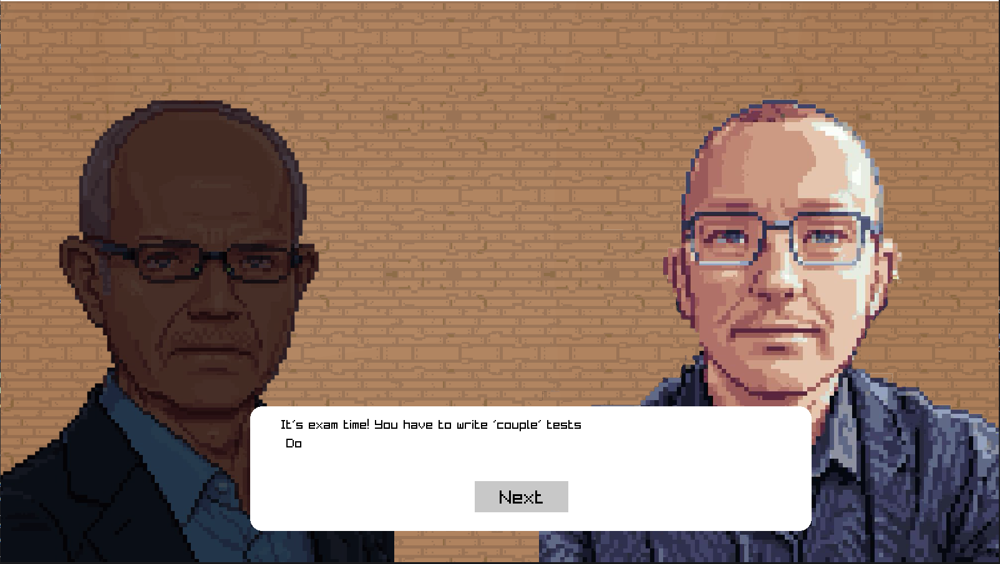
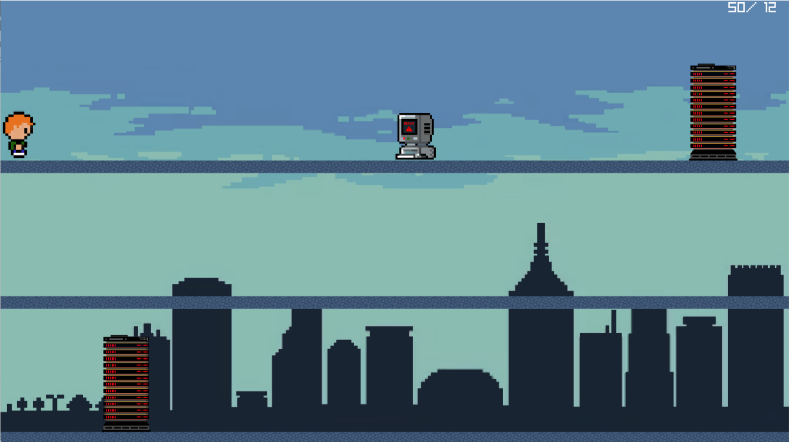
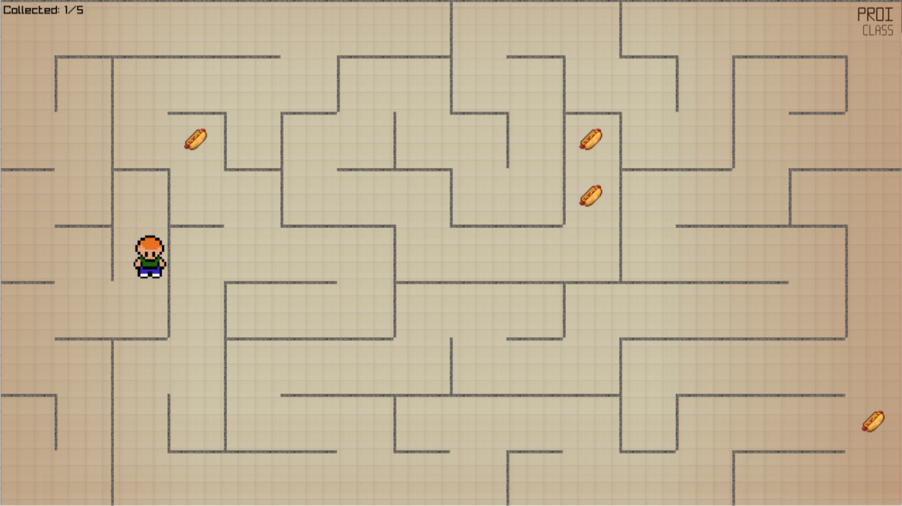
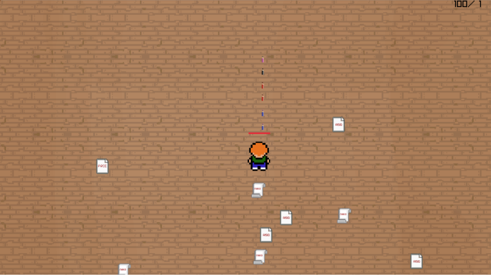

# WEITI Game

---
**Project z PROI 24L**  
**Made by:** Matvii Ivashchenko, Katsyaryna Anikevich  
**Opiekun:** Pan Szymański Zbigniew

---
### 1. Idea projektu
Stworzyliśmy 4 poziomy gry oparte na temacie „studiowanie w WEITI”.  
Każdy poziom symbolizuje określoną część studiowania na uniwersytecie
### 2. Struktura projektu
- **main.cpp**  
  Główny plik Main zarządza scenami. W funkcji main znajduje się pętla monitorująca `currentScreen`, w przypadku jego zmiany funkcja uruchamia żądaną scenę.

- **Tools**  
  - Implementacja rysowania okna dialogowego w celu wyjaśnienia idei poziomu i kontrolowania gracza na poziomie, implementacja uruchomionego tekstu z dźwiękiem, rysowanie nauczycieli
  - Wykorzystywana jest klasa `Window`, która posiada parametr currentScreen typu zmiennego, który może przyjmować wartości (`Menu, LEVEL1, LOSS, VICTORY, EXAM, MAZE, CATH, MAIN`), z których każda odpowiada za scenę/ poziom, który ma zostać uruchomiony.  Posiada metody `setScreen`, `getScreen`.

- **Scenes**  
    Realizacja ekranów `WIN/LOSS`, głównego ekranu oraz ekranu menu

-  **src**  
   Tutaj znajdują się wszystkie testury i dźwięki.

- **Tests**  
  Tutaj znajdują się testy jednostkowe dla plików z folderu levels.

- **levels**
### 3. Levels
**BEFORE LEVELS** 

**Opis:**

Pojawienie się nauczycieli miało na celu wyjaśnienie idei i zarządzanie poziomem

**Realizacja:**

Stworzyliśmy funkcję do rysowania okna dialogowego (`DrawRoundedRectangle`), `drawTeachers`, która przyjmuje argument `isInRightHalf`, dzięki czemu możliwe jest zaimplementowanie zaciemnienia milczącego uczestnika narracji. Dzięki `DrawDialogWindow` tekst pojawia się stopniowo wraz z dźwiękiem. `HandleDialogWindow` to funkcja, która wywołuje wszystkie powyższe funkcje

**1. HEADING TO WEITI**  

   **Opis:**  

   Pierwszy poziom symbolizuje drogę na uniwersytet.  Na nim gracz stale biega, może skakać i przemieszczać się pomiędzy poziomami wysokości.  To wszystko, czego potrzebujesz, aby pokonać przeszkody.  Istnieją dwa rodzaje przeszkód: komputery  i serwery.  Komputery można po prostu przeskakiwać, ale nie serwery, aby jego przejść  należy zmienić poziom wysokości. Kolizja z przeszkodą powoduje porażkę.   

   **Realizacja:**  

   Gracz i przeszkody zaimplementowano przy użyciu tekstury oraz klasy `Rectangle` z biblioteki Raylib, która służy do śledzenia kolizji.  Przeszkody pojawiają się w prawej niewidocznej  części ekranu, w różnych współrzędnych losowo generowanych przez algorytm.  Algorytm sprawdza, czy odległość między nową przeszkodą a poprzednią wynosi co najmniej 200 pikseli, aby poziom mógł zostać pokonany.  Jeżeli ten warunek nie zostanie spełniony, algorytm przesunie nową przeszkodę o 200 pikseli w prawo.Gdy przeszkoda dotrze do lewego końca ekranu, algorytm zgeneruje jej współrzędne ponowmie.

**2. FIRST DAY**

**Opis:**

Trzeci poziom symbolizuje pierwszy dzień na uniwersytecie, podczas którego trzeba znaleźć odpowiednią salę. Gracz porusza się po losowo wygenerowanym labiryncie i musi zebrać 5 hot dogów rozmieszczonych w różnych miejscach. Pozycje hot dogów są generowane losowo, z zachowaniem zasady, aby nie pojawiały się w tym samym miejscu. Gracz zaczyna w lewym dolnym rogu i jego celem jest dotarcie do prawego górnego rogu labiryntu.

**Realizacja:**

Labirynt jest generowany przy użyciu algorytmu tworzenia labiryntów, który usuwa ściany z początkowo pełnej struktury, aby stworzyć przejścia. Pozycja gracza i hot dogów jest zapisana jako współrzędne prostokątów, a ruch gracza oraz sprawdzanie kolizji z hot dogami jest obsługiwane za pomocą klasy Rectangle z biblioteki Raylib. Gra kończy się sukcesem po zebraniu wszystkich hot dogów i dotarciu do wyjścia.

     

**3. PREPARATION**

**Opis:**

Czwarty poziom symbolizuje przygotowanie do egzaminów. Na tym poziomie gracz musi łapać książki i mózgi, aby zdobyć punkty, jednocześnie unikając łapania mediów społecznościowych oraz czatu GPT. Książki dodają 1 punkt, mózgi 3 punkty, a każde z tych przedmiotów upuszczone na podłogę odejmuje 1 punkt. Złapanie mediów społecznościowych również odejmuje 1 punkt, a złapanie czatu GPT kończy grę. Gra kończy się wygraną po zdobyciu 20 punktów.

**Realizacja:**

Obiekty są generowane losowo na ekranie i opadają w dół. Gracz porusza się w lewo i prawo, łapiąc przedmioty. Książki i media społecznościowe pojawiają się ponownie po upadku na podłogę, podczas gdy mózgi pojawiają się co 15 sekund, a czat GPT co każde 5 zebranych przedmiotów. Pozycje gracza i obiektów są zapisywane jako współrzędne prostokątów, a kolizje są śledzone przy użyciu funkcji CheckCollisionRecs z biblioteki Raylib. Wynik gracza jest wyświetlany na ekranie.

**4. EXAM**  

**Opis:**  

Ten poziom reprezentuje sesję egzaminacyjną, musisz poruszać się po ekranie i rzucać ołówkami we wrogów (egzaminami) i nie pozwolić, aby cię dopadli.  Jeśli się do ciebie zbliżą, zaatakują.
Charakterystyka:  
Gracz:  
- Zdrowie - 100  
- Szkoda - 25   
- 
Egzamin:   
- Zdrowie - 25  
- Szkoda - 25

**Realizacja:**

Wrogowie są implementowani poprzez klasę Enemy, która dziedziczy po klasie Rectangle.  Klasa Enemy posiada następujące argumenty: Health, Damage oraz Texture( numer użytej tekstury (która jest generowana losowo)). Metody - oprócz getterów, funkcja ReceiveDamage od kuli, moveToPlayer - zmienia położenie. wroga o jeden piksel w X i/lub Y, do gracza.
Gracz i kuli są implementowane poprzez klasę Rectangle i mają swoje cechy w zmiennych. Textury są dołączone przez współrzędne Rectangle.

### 4. Uruchomienie projektu

Biblioteka [raylib](https://www.raylib.com/) musi być zainstalowana, aby projekt działał