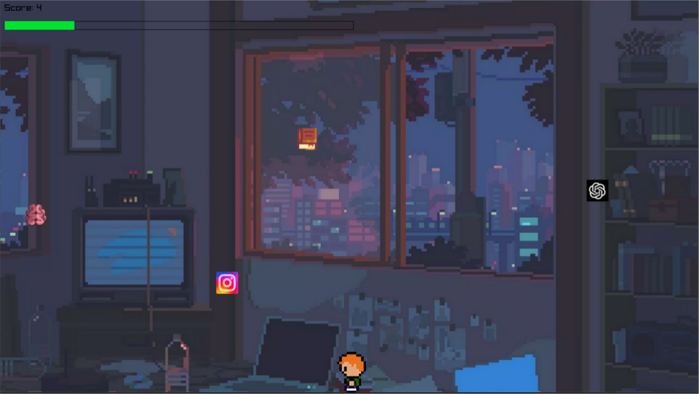

# WEITI Game

---
**Project from PROI 24L**  
**Made by:** Matvii Ivashchenko, Katsyaryna Anikevich  
**Supervisor:** Pan Szymański Zbigniew

---
## 1. Project Idea
We created a game with four levels based on the theme of "studying at WEITI."  
Each level represents a specific aspect of university life.

## 2. Project Structure

- **main.cpp**  
  The main file manages the scenes. The `main` function contains a loop that monitors `currentScreen` and launches the appropriate scene when its value changes.

- **Tools**  
  - Implements drawing of a dialog window to explain the level's idea and guide the player, animated text with sound, and drawing of teachers.
  - Uses the `Window` class, which has a `currentScreen` parameter that can take values (`Menu, LEVEL1, LOSS, VICTORY, EXAM, MAZE, CATH, MAIN`), each corresponding to a different scene or level. It has methods `setScreen` and `getScreen`.

- **Scenes**  
  Implements `WIN/LOSS` screens, the main screen, and the menu screen.

- **src**  
  Contains all textures and sounds.

- **Tests**  
  Contains unit tests for files from the levels folder.

- **levels**  
  Contains the implementation of the game's levels.

## 3. Levels

### BEFORE LEVELS

**Description:**  
Teachers appear to explain the idea and manage the level.

**Implementation:**  
We created a function to draw the dialog window (`DrawRoundedRectangle`) and `drawTeachers`, which takes the argument `isInRightHalf` to implement shading of the silent narrator. With `DrawDialogWindow`, text appears gradually along with sound. `HandleDialogWindow` calls all the above functions.

### 1. HEADING TO WEITI

**Description:**  
The first level symbolizes the way to university. The player continuously runs, can jump, and switch height levels to avoid obstacles. There are two types of obstacles: computers and servers. Computers can be jumped over, but to pass a server, the player must change height. Colliding with an obstacle results in failure.

**Implementation:**  
The player and obstacles are implemented using textures and the `Rectangle` class from the Raylib library for collision detection. Obstacles appear from the right, outside the visible screen, at randomly generated coordinates. An algorithm ensures a minimum of 200 pixels between obstacles. If the condition is not met, the new obstacle is shifted 200 pixels to the right. When an obstacle reaches the left edge of the screen, new coordinates are generated.

### 2. FIRST DAY

**Description:**  
The third level represents the first day at university, where the player must find the right classroom. The player moves through a randomly generated maze, collecting five hot dogs placed in different locations. The hot dogs' positions are generated randomly, ensuring they do not overlap. The player starts in the bottom-left corner and must reach the top-right corner.

**Implementation:**  
The maze is generated using an algorithm that removes walls from a full structure to create paths. The player's and hot dogs' positions are stored as `Rectangle` coordinates. Movement and collision detection are handled using the `Rectangle` class from Raylib. The game is won after collecting all hot dogs and reaching the exit.

### 3. PREPARATION

**Description:**  
The fourth level symbolizes exam preparation. The player must catch books and brains to earn points while avoiding social media and ChatGPT icons. Books add 1 point, brains add 3 points, and dropping any of these items deducts 1 point. Catching social media deducts 1 point, and catching ChatGPT results in instant failure. The player wins after reaching 20 points.

**Implementation:**  
Objects spawn randomly and fall downward. The player moves left and right to catch them. Books and social media icons reappear after falling, while brains appear every 15 seconds and ChatGPT appears every 5 collected items. The positions of the player and objects are stored as `Rectangle` coordinates, and collisions are detected using the `CheckCollisionRecs` function from Raylib. The player's score is displayed on the screen.

### 4. EXAM

**Description:**  
This level represents an exam session where the player must move around the screen, throwing pencils at enemies (exams) and avoiding their attacks. If enemies reach the player, they deal damage.

**Character Attributes:**  
**Player:**  
- Health: 100  
- Damage: 25  

**Exam:**  
- Health: 25  
- Damage: 25  

**Implementation:**  
Enemies are implemented using the `Enemy` class, which inherits from `Rectangle`. The `Enemy` class includes attributes: `Health`, `Damage`, and `Texture` (a randomly generated texture). Methods include `ReceiveDamage` (handles damage from bullets) and `moveToPlayer` (moves the enemy by one pixel in X and/or Y towards the player). The player and bullets are implemented using `Rectangle`, with textures applied based on their coordinates.

## 4. Running the Project

The [raylib](https://www.raylib.com/) library must be installed for the project to work.
